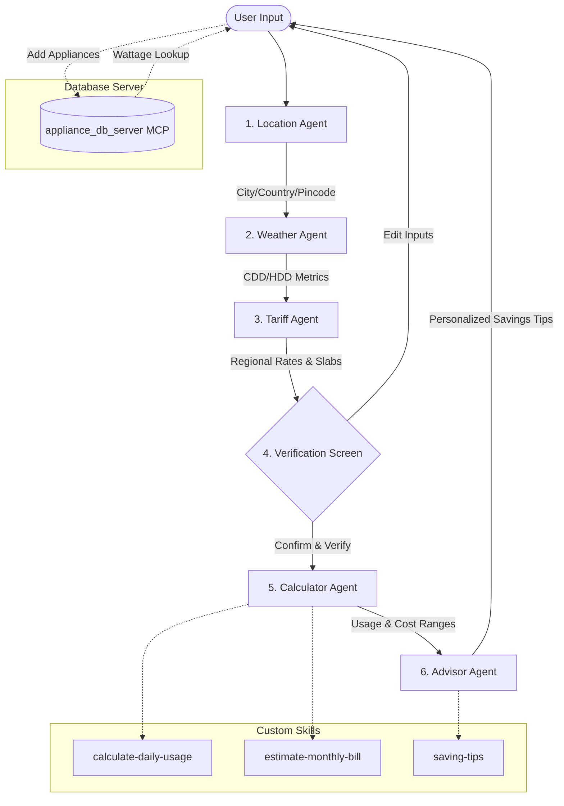

# WattWise ⚡
An agentic electricity bill estimator that helps you understand, review, and reduce your household energy costs.

## Track
**Concierge Agents**

## Course Concepts Demonstrated
1. **Multi-Agent Coordination (GCP ADK / Python)**: Powered by an orchestrator coordinating 6 distinct, single-purpose agents (Location, Weather, Tariff, Verification, Calculator, and Advisor).
2. **Custom Model Context Protocol (MCP) Server**: Integrates a custom Python-based MCP server (`appliance-db-server`) executing wattage lookups with calculated low/high margins.
3. **Human-in-the-Loop Verification**: A strict verification gate prevents calculator execution until the user manually confirms or edits location, weather parameters, appliances, and rates.
4. **Agent Skills**: Guided by custom Markdown skill specifications (`calculate-daily-usage`, `estimate-monthly-bill`, `saving-tips`, `code-reviewer`) with distinct trigger, margin, and validation rules.
5. **CI/CD Integration**: Employs GitHub Actions pipeline (`ci.yml`) validating the project on every push using a 10-test-case validation suite (`run_evals.py`).

## Architecture Flow Diagram


## How to Run
First, install the required dependencies:
```powershell
pip install -r requirements.txt
```

Then, launch the Streamlit application:
```powershell
python -m streamlit run app.py
```

## Disclaimer
> [!IMPORTANT]
> **WattWise provides rough estimates, not exact bill predictions.**

Weather data: Uses Open-Meteo API (free, global, no API key required) for real-time weather fetching.
